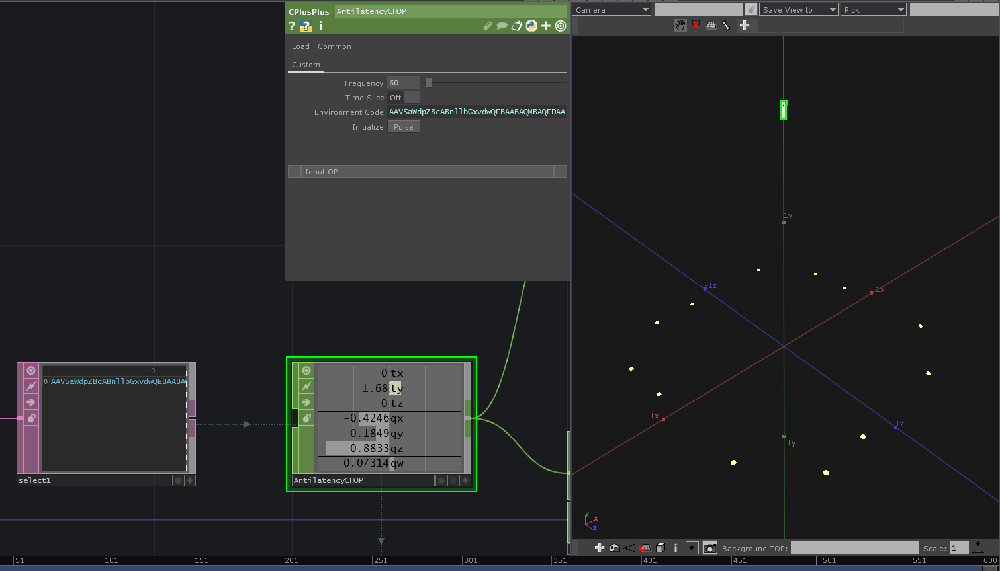

# AntilatencyCHOP

Use [Antilatency](https://antilatency.com/) in [TouchDesigner](https://derivative.ca/).

## Warning
Early test version, not suitable for production environment. Anyone who is interested in this feature is welcome to improve it.

## To-do
- [ ] Support more than one ALT. 
- [ ] Multi-threaded sampling at high speed.
- [x] Export the mark points of the environment configuration to info DAT.
    - [ ] keep info DAT for device info, create an py object for the mark points.
- Paramaters:
    - [ ] Add "Tag" to the channel name. (Toggle)
    - [ ] Add "Serial number" to the channel name. (Toggle)
    - [ ] Add "Device name" to the channel name. (Toggle)
    - [ ] Output RAW pose. (Toggle)
    - [ ] Max ALTs. (Int)

## Known issues
- ~~There are more than two operators at the same time will crash. (Even in different processes)~~ 
    >Fix - but deviceNetwork won't setup again.

- ~~Some specific environment code will cause a crash (it is guessed that it can be decoded by bese64 but the content is incorrect).~~
    >Fix

## Disclaimer
- I am not responsible for any risks caused by using this product in any production site.
- All SDKs and quoted samples are owned by their sources, and I do not claim any rights regarding them.